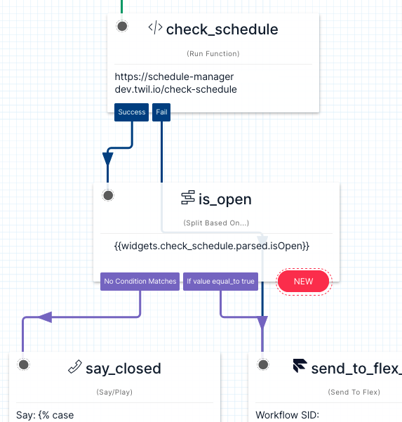

## Prerequisites
After plugin installation, the following sample studio configuration is required to connect incoming calls to check the schedule. Studio flows can be created [here](https://console.twilio.com/us1/develop/studio/flows?frameUrl=/console/studio/flows?x-target-region=us1).



1. Bring a Run Function widget into your flow, named `check_schedule`, configured to the `flex-plugin-library-schedule-manager` service, and `/check-schedule` function.
2. Add to the function parameters: key: `name`, value: `Name of schedule to check` and save.
3. Bring a 'Split Based On...' widget into your flow and set the variable to test: `widgets.check_schedule.parsed.isOpen`
4. Add a condition Equal To `true`, connect it to the step representing your open logic, and save.
5. Connect the 'No Condition Matches' to your closed logic.
6. If you'd like to say different text depending on the closed reason, here is an example you can use in a Say/Play widget:

```




We are currently closed due to unforseen circumstances. Please call back later.



We are currently closed due to the holiday. Please call back during our normal business hours.



We are currently closed. Please call back during our normal business hours.



Thank you for calling and have a great day.
```

## How it works
Plugin is ready to use once it is installed and the browser window is refreshed.
- This plugin adds an icon for the schedule manager in the left menu for admins (only).
- You can set up schedules which are a collection of rules. A rule can prescribe : *open Monday - Friday 8AM - 5PM* or *closed for holiday on September 5*.
- Studio flow can check a schedule and based on rules configured, the status (open/closed) along with the matching rule (if closed) is returned.

## Installation
No input required.
